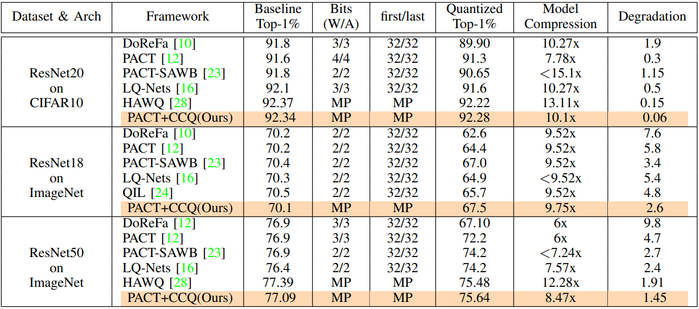

# Competitive Collaborative Quantization (CCQ)

This repo is the PyTorch implementation of our DAC'20 paper on [Learning to Quantize Deep Neural Networks: A Competitive-Collaborative Approach](https://ieeexplore.ieee.org/abstract/document/9218576)

<p align="center">
	
</p>

**Competitive Collaborative Quantization (CCQ)** uses online learning to learn bit-precision for different layers within a neural network using a competitive-collaborative approach during training delivering mixed precision interger inference model. The implementation is essentially a wrapper on [IntelLabs distiller](https://github.com/IntelLabs/distiller/tree/v0.2.0). For requirements please refer to the reuirements.txt file. To install all the dependencies:

```
$ pip install -r requirements.txt
```

## To invoke CCQ
```
$ cd examples/classifier_compression/
$ python ccq.py --model resnet18 --qsteps 10 --gpus 0 --name resq
```
1. This implementation is for resnet18 
2. --qsteps-> determines how many quantization steps to perform
3. --name -> provides a name of to the run, The name argument is important. Ideally, inside the ```examples/classifier_compression/base/``` should contatin the pretrained or 8-bit uniformly quantized model and a csv file containing the PACT clipping values per layer.
```
    ----|->base|
               |->resq0_8b_uniform|
                                  |->resq0_checkpoint.pth.tar
                                  |->resq0_8b_uniform.log
               |->pact_track.csv
    ----|->yaml_dir|
                   |base_q_schedule.yaml 
```
4. The ```pact_track.csv``` contains the learned clipping values of each layers during pretraining.
5. The ```--name``` argument should match with the pretrained model prefix ```resq```. This is important 
6. The ```base_q_schedule.yaml``` contains the per-layer bit configuration. The provided file is for resnet18. For other networks, similar file should be used. In this particular case, a pretrained int8 uniformly quantized model was used which reflects on the file as well.

## Citation
If you found the repository helpful, please cite using the following:
```
@INPROCEEDINGS{9218576,
  author={Khan, Md Fahim Faysal and Kamani, Mohammad Mahdi and Mahdavi, Mehrdad and Narayanan, Vijaykrishnan},
  booktitle={2020 57th ACM/IEEE Design Automation Conference (DAC)}, 
  title={Learning to Quantize Deep Neural Networks: A Competitive-Collaborative Approach}, 
  year={2020},
  volume={},
  number={},
  pages={1-6},
  doi={10.1109/DAC18072.2020.9218576}}
```

## Acknowledgement
This work was supported in part by C-BRIC (Center for Braininspired Computing), one of six centers in JUMP, a Semiconductor Research Corporation (SRC) program sponsored by DARPA.